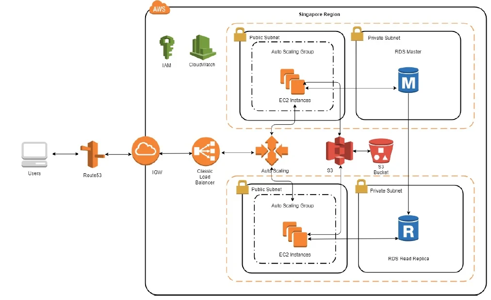

# Auto Scaling

### Table of Contents

- [Application Load Balancer using AWS](#application-load-balancer-using-aws)
- [Auto Scaling Group using AWS](#auto-scaling-group-using-aws)
- [Application Load Balancer and Auto Scaling Group using Terraform](#application-load-balancer-and-auto-scaling-group-using-terraform)

## Application Load Balancer using AWS

1. Create 3 subnets (public) in the same VPC.
2. Launch on instance with app running in one of the subnets.
3. Go to section `Load Balancer` inside `EC2`.
4. Click on `Create Load Balancer`.
5. Select `Application Load Balancer`.
6. Tag a name: `eng84-jose-alb`.
7. Select `internet-facing` and `ipv4`.
8. Listener: make sure you have http with port `80` to request in the app.
9. Availability zones: select the VPC that we have created and then tick on the three subnets to have highly available.
10. Go to next step: `Security Groups`.
11. Create a new security group and make sure you have the next rule: Custom TCP, TCP, 80, Custom: 0.0.0.0/0, ::/0
12. Go to next step: `Configure routing`.
13. Target group: `new target group`.
14. Name: `jose-app-targe-group`.
15. Target type: `Instance`
16. Protocol `HTTP` and Port `80`.
17. Go to next step: `Register Targets`.
18. In the `instances`, select the instance that is running with the app working and click on `Add to registered`. You will see your instance available in the registered targets.
19. Next step: `Review` and `Create`.
20. Go to the new balancer, and in the tab `Description`, copy the `DNS name` and paste it in the browser. Now you will see your application running using the DNS name or using the public ip of the app.

## Auto Scaling Group using AWS

1. Terminate the instances that you are running. Don't worry they'll be recreated soon and make sure you have created your ALB like the previous step.
2. Go to section `Auto Scaling Groups` inside `EC2`.
3. Click on `Create an Auto Scaling group`.
4. Tag a name: `eng84_jose_asg_app`.
5. Click on `Create a launch template`:
	- Tag a name and description: `eng84_jose_launch_template`.
	- AMI - required: select your web app AMI.
	- Instance type: `t2.micro`
	- Key pair: select your key pair to be able to connect.
	- Networking Settings: `VPC`.
	- Network interfaces: in security groups select your security group of the app that we have created before and enable auto-assign public ip.
	- Expand advanced details: In the tab `User data`, copy and paste your contents from your provision.sh file to run the app.
6. Select the launch template that you have created and go to the next step: `Configure settings`.
7. Select the `VPC` we have created and the three public subnets that we used in the ALB.
8. In the step `Configure advanced options`, select the aplication load balancer we have created previously.
9. Health checks: `EC2` and `60 seconds`.
10. In the next step `Configure group size and scaling policies`, select `3` in desired capaticty, minimun capacity and maximum capicity.
11. In the next step `Add notifications`, leave empty.
16. In the next step `Add tags`, create a new one for the instances. Key `name`, Value `eng84_jose_app_asg`, Tag new instances `Yes`.
17. Finally, click on `Create Auto Scaling group`.

## Application Load Balancer and Auto Scaling Group using Terraform
