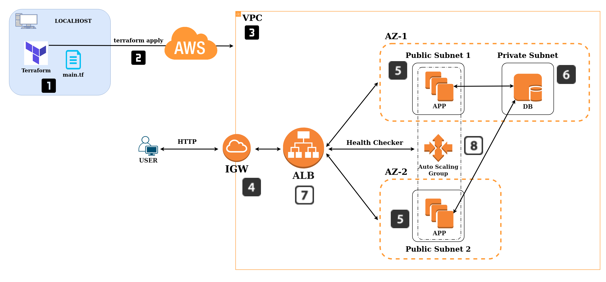

# Auto Scaling - Highly Available Task


### Table of Contents

- [Task](#task)
- [Diagram](#Diagram)
- [Application Load Balancer using AWS](#application-load-balancer-using-aws)
- [Auto Scaling Group using AWS](#auto-scaling-group-using-aws)
- [Application Load Balancer and Auto Scaling Group using Terraform](#application-load-balancer-and-auto-scaling-group-using-terraform)
- [Route 53 - Load Balancers - Scaling](#route-53---load-balancers---scaling)

## Task

The goal is to create a highly available application using IaC tool Terraform.

__Acceptance Criteria__

- 1 Diagram for this task's architecture created and added to your documentation with steps mentioned.

- Node app working with DB. Terraform apply to create target group (Application Load Balancer) and add to auto scaling group with /posts loading DB from DB instance.

- Create a maximum 5 minutes video with code demo and maximum 6 pages of presentation about IAC Orchestration with Terraform and this task.

## Diagram

In order to create a highly available application, we will need an Auto-Scaling Group, with an Application Load Balancer attached.



__Steps:__

1. We install and configure Terraform. We configure the variables that will help us connect to AWS and we write the code in the main file.
2. We execute the file with the command `terraform apply`.
3. Our Virtual Private Cloud will be created first.
4. Then our internet gateway will be created that will be attached to our VPC to have contact with the outside. Two routes tables will also be created, one for the public subnets and the other for the private subnet.
5. We will create two public subnets in different Availability Zones.
6. Then only one private subnet is created for the database ass well as the security groups for the app and the database and the database instance itself.
7. We proceed to create our Application Load Balancer that will help us control inbound traffic between the two Availability Zones.
8. And finally we create our Auto Scaling Group that will help us launch the instances app with the template.

Congratulations, you will have access to the app using the public ip address of the app or using the DNS name of the ALB. You will also have access to the /posts option.

## Application Load Balancer using AWS

1. Create 3 subnets (public) in the same VPC.
2. Launch on instance with app running in one of the subnets.
3. Go to section `Load Balancer` inside `EC2`.
4. Click on `Create Load Balancer`.
5. Select `Application Load Balancer`.
6. Tag a name: `eng84-jose-alb`.
7. Select `internet-facing` and `ipv4`.
8. Listener: make sure you have http with port `80` to request in the app.
9. Availability zones: select the VPC that we have created and then tick on the three subnets to have highly available.
10. Go to next step: `Security Groups`.
11. Create a new security group and make sure you have the next rule: Custom TCP, TCP, 80, Custom: 0.0.0.0/0, ::/0
12. Go to next step: `Configure routing`.
13. Target group: `new target group`.
14. Name: `jose-app-targe-group`.
15. Target type: `Instance`
16. Protocol `HTTP` and Port `80`.
17. Go to next step: `Register Targets`.
18. In the `instances`, select the instance that is running with the app working and click on `Add to registered`. You will see your instance available in the registered targets.
19. Next step: `Review` and `Create`.
20. Go to the new balancer, and in the tab `Description`, copy the `DNS name` and paste it in the browser. Now you will see your application running using the DNS name or using the public ip of the app.

## Auto Scaling Group using AWS

1. Terminate the instances that you are running. Don't worry they'll be recreated soon and make sure you have created your ALB like the previous step.
2. Go to section `Auto Scaling Groups` inside `EC2`.
3. Click on `Create an Auto Scaling group`.
4. Tag a name: `eng84_jose_asg_app`.
5. Click on `Create a launch template`:
	- Tag a name and description: `eng84_jose_launch_template`.
	- AMI - required: select your web app AMI.
	- Instance type: `t2.micro`
	- Key pair: select your key pair to be able to connect.
	- Networking Settings: `VPC`.
	- Network interfaces: in security groups select your security group of the app that we have created before and enable auto-assign public ip.
	- Expand advanced details: In the tab `User data`, copy and paste your contents from your provision.sh file to run the app.
6. Select the launch template that you have created and go to the next step: `Configure settings`.
7. Select the `VPC` we have created and the three public subnets that we used in the ALB.
8. In the step `Configure advanced options`, select the aplication load balancer we have created previously.
9. Health checks: `EC2` and `60 seconds`.
10. In the next step `Configure group size and scaling policies`, select `3` in desired capaticty, minimun capacity and maximum capicity.
11. In the next step `Add notifications`, leave empty.
16. In the next step `Add tags`, create a new one for the instances. Key `name`, Value `eng84_jose_app_asg`, Tag new instances `Yes`.
17. Finally, click on `Create Auto Scaling group`.

## Application Load Balancer and Auto Scaling Group using Terraform

__1. Create a VPC with an Internet Gateway to have connection to the world__

````
provider "aws"{
# define the region to launch the ec2 instance in Ireland	
	region = "eu-west-1"
}

# Creating a VPC
resource "aws_vpc" "jose_terraform_asg_vpc"{
 cidr_block = var.aws_vpc_cidr
 instance_tenancy = "default"

 tags = {
   Name = "${var.aws_vpc}"
 }
}

# Creating an internet gateway
resource "aws_internet_gateway" "jose_terraform_asg_igw" {
  vpc_id = aws_vpc.jose_terraform_asg_vpc.id

  tags = {
    Name = var.aws_igw
  }
}
````

__2. Create one public route table and set up it as a main route table for the VPC. Attach also the internet gateway__

````
# Editing the main Route Table
resource "aws_default_route_table" "jose_terraform_asg_rt_public" {
  default_route_table_id = aws_vpc.jose_terraform_asg_vpc.default_route_table_id

  route {
    cidr_block = "0.0.0.0/0"
    gateway_id = aws_internet_gateway.jose_terraform_asg_igw.id
  }

  tags = {
    Name = var.aws_public_rt
  }
}
````

__3. Let's create two public subnets in different AZ. Associate the main route table with the public subnets__

````
# Creating Public Subnet 1 - AZ1
resource "aws_subnet" "jose_terraform_asg_public_subnet1" {
  vpc_id = aws_vpc.jose_terraform_asg_vpc.id
  cidr_block = var.aws_public1_cidr
  availability_zone = "eu-west-1a"

  tags = {
    Name = "${var.aws_subnet_public}-1"
  }
}

# Creating Public Subnet 2 - AZ2
resource "aws_subnet" "jose_terraform_asg_public_subnet2" {
  vpc_id = aws_vpc.jose_terraform_asg_vpc.id
  cidr_block = var.aws_public2_cidr
  availability_zone = "eu-west-1b"

  tags = {
    Name = "${var.aws_subnet_public}-2"
  }
}

# Associating main route table with public subnets
resource "aws_route_table_association" "jose_terraform_asg_asoc1" {
  subnet_id = aws_subnet.jose_terraform_asg_public_subnet1.id
  route_table_id = aws_vpc.jose_terraform_asg_vpc.default_route_table_id
}

resource "aws_route_table_association" "jose_terraform_asg_asoc2" {
  subnet_id = aws_subnet.jose_terraform_asg_public_subnet2.id
  route_table_id = aws_vpc.jose_terraform_asg_vpc.default_route_table_id
}
````

__4. Create the private route table that we are going to use it only for the private subnet, to keep our database safe, without anyone having contact with it from outside__

````
# Creating Private Route Table
resource "aws_route_table" "jose_terraform_asg_rt_private" {
  vpc_id = aws_vpc.jose_terraform_asg_vpc.id

  tags = {
    Name = var.aws_private_rt
  }
}
````

__5. Let's create the private subnet for the database and associate it with the private route table that we have created before__

````
# Creating Private Subnet - AZ1
resource "aws_subnet" "jose_terraform_asg_private_subnet" {
  vpc_id = aws_vpc.jose_terraform_asg_vpc.id
  cidr_block = var.aws_private_cidr
  availability_zone = "eu-west-1a"

  tags = {
    Name = "${var.aws_subnet_private}"
  }
}

# Associating private route table with private subnet
resource "aws_route_table_association" "jose_terraform_asg_asoc3" {
  subnet_id = aws_subnet.jose_terraform_asg_private_subnet.id
  route_table_id = aws_route_table.jose_terraform_asg_rt_private.id
}
````

__6. Create a security group for the app instance__

````
# Creating security group for app
resource "aws_security_group" "jose_terraform_asg_public_sg" {
 name = var.aws_public_sg
 description = "App security group from Terraform"
 vpc_id = aws_vpc.jose_terraform_asg_vpc.id

 # Inbound rules for our app
 # Inbound rules code block:
 ingress {
  from_port = "80" # for our to launch in the browser
  to_port = "80" # for our to launch in the browser
  protocol = "tcp"
  cidr_blocks = ["0.0.0.0/0"] # allow all
 }

 ingress {
  from_port = "22"
  to_port = "22"
  protocol = "tcp"
  cidr_blocks = [var.my_ip]
  description = "Allow admin to SSH"
 }
 # Inbound rules code block ends

 # Outbound rules code block
 egress{
  from_port = 0
  to_port = 0
  protocol = "-1" # allow all
  cidr_blocks = ["0.0.0.0/0"]
 }
 # Outbound rules code block ends
}
````

__7. Create a security group for the db instance__

````
# Creating security group for db
resource "aws_security_group" "jose_terraform_asg_private_sg" {
  name = var.aws_private_sg
  description = "Db security group from Terraform"
  vpc_id = aws_vpc.jose_terraform_asg_vpc.id

  ingress {
    from_port         = "22"
    to_port           = "22"
    protocol          = "tcp"
    cidr_blocks       = [var.my_ip]
  }

  ingress {
    from_port = 0
    to_port = 0
    protocol = "-1"
    security_groups = [aws_security_group.jose_terraform_asg_public_sg.id]
    description = "Allow all traffic from the app"
  }

  egress {
    from_port = "0"
    to_port = "0"
    protocol = "-1"
    cidr_blocks = ["0.0.0.0/0"]
  }
}
````

__8. Create the DB instance using an AMI__

````
# Creating DB instance
resource "aws_instance" "db_instance"{
  # add the AMI id between "" as below
  ami = var.db_ami_id

  # Let's add the type of instance we would like launch
  instance_type = "t2.micro"

  # Subnet
  subnet_id = aws_subnet.jose_terraform_asg_private_subnet.id

  private_ip = var.db_ip

  # Security group
  vpc_security_group_ids = [aws_security_group.jose_terraform_asg_private_sg.id]

  # Do we need to enable public IP for our app
  associate_public_ip_address = true

  key_name = var.key

  # Tags is to give name to our instance
  tags = {
    Name = "${var.aws_db}"
  }
}
````

__9. We proceed to create our Application Load Balancer__

````
# Creating the Application Load Balancer
resource "aws_lb" "jose_terraform_asg_load_balancer" {
  name               = "eng84-jose-terraform-alb"
  internal           = false
  load_balancer_type = "application"
  ip_address_type    = "ipv4"
  enable_deletion_protection = false
  security_groups    = [aws_security_group.jose_terraform_asg_public_sg.id]
  subnets            = [aws_subnet.jose_terraform_asg_public_subnet1.id, aws_subnet.jose_terraform_asg_public_subnet2.id]
}
````

__10. Let's create our target group that will be used to route requests to one or more registered targets__

````
# Creating the target group:
resource "aws_lb_target_group" "jose_terraform_asg_target_group" {
  name     = "eng84-jose-terraform-tg-app"
  port     = 80
  protocol = "HTTP"
  target_type = "instance"
  vpc_id   = aws_vpc.jose_terraform_asg_vpc.id
}
````

__11. Let's define our listener. The rules that you define for a listener determine how the load balancer routes requests to its registered targets, so will forward traffic from our load balancer to our target group__

````
# Creating a listener
resource "aws_lb_listener" "jose_terraform_asg_listener" {
  load_balancer_arn = aws_lb.jose_terraform_asg_load_balancer.arn
  port              = "80"
  protocol          = "HTTP"

  default_action {
    type             = "forward"
    target_group_arn = aws_lb_target_group.jose_terraform_asg_target_group.arn
  }

  depends_on = [aws_lb_target_group.jose_terraform_asg_target_group, aws_lb.jose_terraform_asg_load_balancer]
}
````

__12. Our ALB is defined, so now we need to create a launch template based on an AMI that we will use in our Auto-Scaling group__

````
# Creating launch template for Auto Scaling Group
resource "aws_launch_template" "jose_terraform_asg_launch_template" {
  name          = "eng84_jose_terraform_autosg_lt"
  description = "template for web application"
  ebs_optimized = false
  image_id      = var.webapp_ami_id
  instance_type = "t2.micro"
  key_name = var.key

  network_interfaces {
    associate_public_ip_address = true
    delete_on_termination = true
    security_groups = [aws_security_group.jose_terraform_asg_public_sg.id]
  }

  tag_specifications {
    resource_type = "instance"
    tags = {
      Name = "eng84_jose_terraform_autosg_app"
    }
  }
  
  # Running the provision file when a new instance is launched
  user_data = filebase64("./scripts/init.sh")
}
````

__13. Finally, we will create our Auto-Scaling Group which will use the template that we have created to launch as many as app instances we want in the differents subnets (different AZ)__

````
# Creating Auto Scaling Group
resource "aws_autoscaling_group" "jose_terraform_auto_scaling_group" {
  name = "eng84_jose_terraform_autosg"
  desired_capacity = 2
  max_size         = 2
  min_size         = 2
  
  # Heath checks
  health_check_grace_period = 50
  health_check_type         = "ELB"
  force_delete = true

  # Attaching load balancer in the form of a target group
  target_group_arns = [aws_lb_target_group.jose_terraform_asg_target_group.arn]

  vpc_zone_identifier = [aws_subnet.jose_terraform_asg_public_subnet1.id, aws_subnet.jose_terraform_asg_public_subnet2.id]

  # Launching template the last version
  launch_template {
    id      = aws_launch_template.jose_terraform_asg_launch_template.id
    version = "$Latest"
  }

  depends_on = [aws_launch_template.jose_terraform_asg_launch_template]
}
````

__We are going to check that the auto scaling group is working correctly together with the ALB__

We currently have two app instances running and working properly. We can check it by accessing our auto scaling group in the `Instaces` tab and we will see that they are all in a healthy state. We can also check it within our target group in the `targets` tab.

- We proceed to connect to one of the app instance via ssh and stop the execution of the application.
- We proceed to access the `Target groups` session, and in the` Attributes` tab we modify the value of `Deregistration delay` to` 10 seconds` to avoid having to wait long.
- We go back to the `Target groups` section and then in the` Targets` tab quickly again and after 10 seconds we can see that the machine from which we have stopped executing the app has gone unhealthy.
- We proceed to see the instances from our auto scaling group. Here we will also see that one of the instance has been marked as unhealthy thanks to the health check.
- What will happen now is that the instance that is in unhealthy state will proceed to terminate and proceed to create a new instance for the reason that our min and max instance in our auto scaling group is two and as one has been terminated, it is he proceeds to create another to replace him.

This is all about how the health check between ALB and Auto scaling group works.

## Route 53 - Load Balancers - Scaling

To have more information in deep about these three concepts, click on the following [link](https://github.com/alfonso-torres/eng84_Highly_Available_app).
